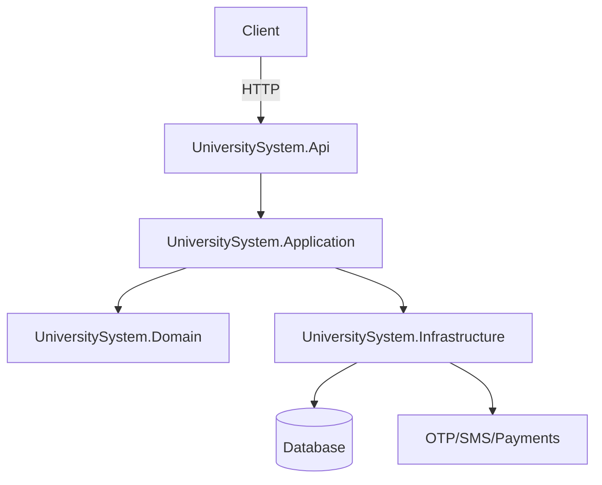

# Backend Overview — UniversitySystem

This document describes the backend architecture, responsibilities, and developer run instructions for the UniversitySystem services contained in the `backend/` folder.

## Purpose and scope

The backend implements the core business capabilities for Gadag-University: admissions and registration workflows, student record management, fee collection and receipts, notifications (SMS/OTP), and administrative reporting. It is designed as a layered .NET solution to keep concerns separated, testable, and independently deployable.

## Projects in this solution

- `UniversitySystem.Api` — ASP.NET Core Web API exposing REST endpoints and handling authentication/authorization, request validation, and API contracts.
- `UniversitySystem.Application` — Application services, use-case orchestration, DTOs, and transaction boundaries.
- `UniversitySystem.Domain` — Domain entities, value objects, domain interfaces, and business rules; contains no infrastructure-specific code.
- `UniversitySystem.Infrastructure` — Implementations of persistence (repositories/ORM), external service clients (OTP, SMS, payment hooks), file storage for `Assets`/`Attachments`, and other platform concerns.

## Layered architecture and responsibilities

- Presentation / API layer (`UniversitySystem.Api`)
	- Exposes controllers in `Controllers/` which map HTTP requests to application use-cases.
	- Handles request/response models, input validation, error mapping, and OpenAPI documentation (YAML/contract files live in `UniversitySystem API/`).

- Application layer (`UniversitySystem.Application`)
	- Coordinates use-cases, enforces application-level workflows and transactions, composes domain operations, and maps domain models to DTOs for the API.

- Domain layer (`UniversitySystem.Domain`)
	- Holds core business logic and invariants via entities and domain services.
	- Defines interfaces that the infrastructure layer implements (e.g., repository interfaces, external client interfaces).

- Infrastructure layer (`UniversitySystem.Infrastructure`)
	- Implements persistence (database access, migrations), file storage (Assets/Attachments), and integrations (SMS, OTP, Payments, webhooks).
	- Contains concrete implementations of domain interfaces and cross-cutting integrations.

## Data flow (simplified)

1. Client (frontend or external webhook) sends HTTP request to `UniversitySystem.Api`.
2. Controller authenticates (if required), validates input, and forwards to an application service.
3. Application service executes use-cases by invoking domain operations and repository abstractions.
4. Infrastructure provides concrete data access and external service calls; transaction boundaries are typically managed in the application layer.
5. Results are mapped to DTOs and returned to the client.



## Key directories & files

- `backend/UniversitySystem.Api/Controllers` — API controllers and endpoint implementations.
- `backend/UniversitySystem.Api/appsettings*.json` — Environment configuration and connection strings.
- `backend/UniversitySystem.Application/` — Application services, DTOs, and use-case implementations.
- `backend/UniversitySystem.Domain/Entities` — Core domain entities and interfaces.
- `backend/UniversitySystem.Infrastructure/` — Repository implementations, integrations, and data access code.
- `UniversitySystem API/` — API contract files (OpenAPI/YAML) and collection artifacts for external integrations.
- `Assets/` and `Attachments/` — File storage used by the infrastructure layer for documents and photos.

## Integrations & external dependencies

- Database: relational database (configured via connection strings in `appsettings.json`).
- External services: OTP providers, SMS gateways, payment providers (Easebuzz, PhonePe), and webhook listeners.
- File storage: local assets directory; configurable for cloud storage in production.

## Configuration and secrets

- Use `appsettings.json` for defaults and `appsettings.Development.json` for local overrides. Keep secrets out of source control — inject via environment variables or secret management in CI/CD.

## Running locally (developer quick-start)

```bash
cd backend/UniversitySystem.Api
dotnet restore
dotnet run
```

Notes:
- Check `appsettings.development.json` for dev port and DB settings.
- To run tests and automation, use the `AutomationTesting` project for end-to-end scenarios.

## Testing and CI

- Unit tests should target `UniversitySystem.Application` and `UniversitySystem.Domain` to validate business logic.
- Integration and E2E tests live in `AutomationTesting` and exercise the API and frontend interactions.
- CI pipelines should build the solution, run unit/integration tests, and validate the OpenAPI contract files.

## Operational considerations

- Migrations and schema changes should be applied via a well-defined migration process; keep DB migrations versioned with code.
- Monitor external integrations (retries, idempotency) and design webhook endpoints to be idempotent.
- Secure all endpoints, enforce authentication and authorization, and validate/limit payload sizes for file uploads.

## Next steps and recommendations

- Add a `README.md` inside `backend/UniversitySystem.Api` with clear environment variables, DB migration commands, and local development UX.
- Consider moving file storage to cloud-backed storage for scalability and to simplify deployments.
- Maintain/update OpenAPI definitions in `UniversitySystem API/` when endpoints change.
